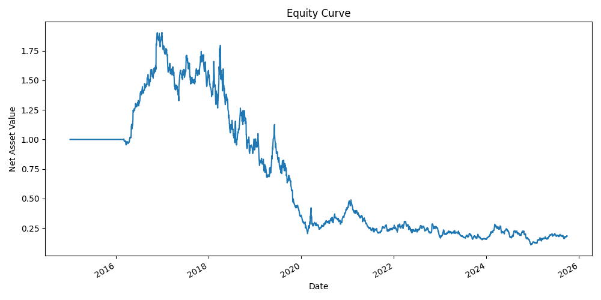
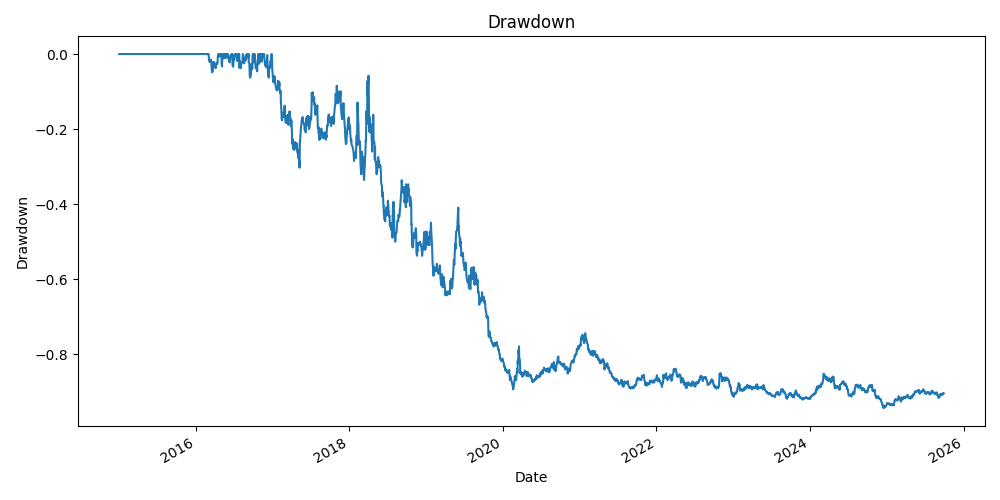

# Momentum Long/Short Backtest (2015–2025)

**Universe:** 31 large-cap US equities  
**Signal:** 12–1 month momentum (skip last 21 trading days)  
**Rebalance:** Monthly (first trading day on/after month-end)  
**Costs:** 10 bps per unit of turnover  
**Backtest window:** 2015-01-02 → 2025-09-29 (2701 trading days)

## Results (net of costs)
- **CAGR:** 12.08%
- **Annual Volatility:** 26.42%
- **Sharpe (rf=0):** 0.56
- **Max Drawdown:** −46.08%
- **Calmar:** 0.26
- **Hit Rate:** 46.76%

## Charts

## Method
1. Download daily Adjusted Close via `yfinance`  
2. Compute 12–1 momentum: price(t−21) / price(t−252−21) − 1  
3. Rank cross-section; **long top 10%**, **short bottom 10%**, equal-weight  
4. Monthly rebalance; turnover-based costs deducted daily  
5. Evaluate CAGR, Sharpe, Max DD, Calmar, Hit Rate

## Notes & Next Steps
- Drawdowns are large → add **volatility targeting** or **risk scaling**  
- Try different universes (e.g., S&P 100) and **cost sensitivity** (5–20 bps)  
- Consider **walk-forward** validation / out-of-sample period
